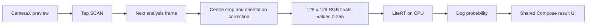

# ScannerCatDogs

A mobile portfolio project that brings a trained cat/dog image classifier onto a phone. Point the Android camera at an animal, tap **SCAN**, and see the prediction generated locally by a bundled machine learning model.

The project demonstrates the path from a separately trained TensorFlow/Keras model to a mobile application: a versioned model contract, native inference, a shared Kotlin interface, and a Compose Multiplatform UI.

## Current status

| Area | Status |
| --- | --- |
| Android | Live camera preview, camera permission flow, scan button, and result UI implemented; emulator validation documented |
| Model inference | Both bundled TFLite models checked against reference images on an Android emulator |
| Shared UI | Single Compose screen with loading, permission, result, and error states |
| iOS | Application entry point and shared UI integration exist; camera and inference are stubs and have not been compiled or tested on iOS |
| Photo selection and demo gallery | Not implemented |
| Continuous classification | Not implemented; each prediction requires a tap on SCAN |

Status documented on **2026-09-13**. This is a demonstration and portfolio application under development.

## Using the app

1. Launch the Android app and allow camera access.
2. Place a cat or dog near the centre of the preview. The square is a framing guide.
3. Tap **SCAN**. The next available camera frame is processed on a background executor.
4. Read the result: **DOG** in amber or **CAT** in violet, with a score and the model's raw dog probability.
5. Tap again to classify another frame.

The preview stays live after a prediction. The displayed result belongs to the last scan and remains until another scan changes it.

The model is bundled in the Android application. Classification needs no account, server, model download, or internet connection. The current scanner processes frames in memory and does not save or upload photos.

## How classification works



The Android classifier uses LiteRT's `CompiledModel` API. The normal app flow loads the standard model on its first scan and reuses it for subsequent predictions. CameraX uses `STRATEGY_KEEP_ONLY_LATEST`; bitmap conversion and inference happen only when a scan is requested.

The [model contract](docs/MODEL_CONTRACT.md) defines the input and output:

| Property | Value |
| --- | --- |
| Input | Tensor 0, `[1, 128, 128, 3]`, NHWC, `float32` |
| Pixel format | RGB, raw values from 0 to 255 |
| App preprocessing | Centre crop and orientation correction for camera frames, bilinear resize, RGB extraction |
| Normalization | Inside the model; the app must **not divide pixels by 255** |
| Output | Tensor 0, `[1, 1]`, sigmoid dog probability `p` |
| Decision | `p > 0.5` means dog; otherwise cat |
| Displayed score | `p` for dog or `1 - p` for cat, shown as a percentage |

### Model and evaluation

The model is trained in a separate ML project using **MobileNetV3Small**, initialized with ImageNet weights. Training first fits a classification head, then fine-tunes the last 20 backbone layers while keeping BatchNormalization layers frozen.

The published contract records the following results for the **Keras model on a held-out test set of 2,000 images**:

| Metric | Value |
| --- | --- |
| Accuracy | 94.35% |
| Precision, dog as positive class | 95.03% |
| Recall, dog as positive class | 93.60% |

These are model evaluation results, not a measurement of live-camera accuracy. The displayed percentage for an individual scan is a model score, not a guarantee that the prediction is correct.

Two artifacts from model release **v1.0.0** are included in [Android assets](shared/src/androidMain/assets):

| Model | Approximate size | Role |
| --- | --- | --- |
| `cat_dog_mobilenetv3.tflite` | 3.58 MiB | Default model, float32 weights; the app currently runs it on CPU |
| `cat_dog_mobilenetv3_optimized.tflite` | 1.08 MiB | Dynamic-range quantized weights with float input/output; CPU-only in this project, covered by reference tests |

There is currently no model or accelerator selector in the UI. Full test-set accuracy of the optimized model has not been measured in the documented evaluation.

## Architecture

The UI and classification result types live in shared Kotlin code. Camera access and inference stay in platform code behind the `Scanner` interface and the `expect`/`actual` functions `rememberScanner` and `CameraPreview`.

| Location | Responsibility |
| --- | --- |
| [androidApp](androidApp) | Android launcher activity, application manifest, and app packaging |
| [shared/src/commonMain](shared/src/commonMain) | `ScannerScreen`, theme, scanner states, classification types, and model constants |
| [shared/src/androidMain](shared/src/androidMain) | CameraX integration, camera permission handling, LiteRT classifier, and bundled assets |
| [shared/src/iosMain](shared/src/iosMain) | Compose view controller and scanner stub reporting `CameraStatus.Unavailable` |
| [iosApp](iosApp) | SwiftUI application entry point and Xcode project |
| [shared/src/androidDeviceTest](shared/src/androidDeviceTest) | Tests that run the real models against the reference images |
| [docs](docs) | Model interface and library/architecture research |

`AndroidCatDogClassifier` accepts a bitmap and returns a `Classification`; it does not depend on the camera. `ScannerScreen` renders scanner state without Android camera or bitmap types.

## Technology stack

Versions are pinned in the [version catalog](gradle/libs.versions.toml).

| Component | Configured version |
| --- | --- |
| Kotlin | 2.4.10 |
| Compose Multiplatform | 1.11.1 |
| Material 3 | 1.11.0-alpha07 |
| Lifecycle, Multiplatform artifacts | 2.11.0-beta01 |
| CameraX | 1.6.2 |
| LiteRT | 2.2.0 |
| Android Gradle Plugin | 9.0.1 |
| Gradle wrapper | 9.1.0 |
| Android compile / target / minimum SDK | 36 / 36 / 24 |
| JVM bytecode target | 11 |
| Gradle daemon toolchain | Azul JDK 21 |

The shared module uses `com.android.kotlin.multiplatform.library`, with a separate Android application module. The Material 3 and Lifecycle dependencies are prerelease versions. Library choices and platform considerations are documented in [RESEARCH.md](docs/RESEARCH.md).

## Build and run

### Android prerequisites

- Android Studio with support for the configured Kotlin and AGP versions.
- Android SDK Platform 36 and the SDK tools requested during Gradle sync.
- A Java installation to launch Gradle. The daemon toolchain is configured for Azul JDK 21 and may require a download on first use.
- A camera-capable Android device with API 24 or newer, or an emulator. The documented reference-test device is a Pixel 8 AVD with API 36 and an `x86_64` image; LiteRT does not bundle 32-bit `x86` binaries.
- Internet access for initial dependency/toolchain downloads. The installed scanner itself works offline.

Open the repository root in Android Studio, let Gradle sync, and select an Android device or emulator. Android Studio normally creates the machine-specific `local.properties` SDK path; keep that file out of Git.

From the repository root in **Windows PowerShell**:

```powershell
$env:JAVA_HOME = 'C:\Program Files\Android\Android Studio\jbr'
.\gradlew.bat :androidApp:assembleDebug
.\gradlew.bat :androidApp:installDebug
```

Adjust `JAVA_HOME` if Android Studio or Java is installed elsewhere. Installation requires a running emulator or a USB-connected phone with debugging authorized. Launch **ScannerCatDogs** from the device launcher, or run the `androidApp` configuration in Android Studio.

The debug APK is generated at `androidApp/build/outputs/apk/debug/androidApp-debug.apk`.

On macOS or Linux, with Java configured:

```bash
./gradlew :androidApp:assembleDebug
./gradlew :androidApp:installDebug
```

### iOS development

iOS development requires macOS and Xcode 26.4 or newer for the configured Kotlin toolchain. The project declares `iosArm64` and `iosSimulatorArm64` targets and produces a static `Shared` framework.

Open [iosApp.xcodeproj](iosApp/iosApp.xcodeproj) in Xcode and configure signing for a physical device as needed. This is an unfinished target: camera access, permission handling, and inference remain unimplemented, and the iOS build has not been validated. The current scanner stub reports camera unavailability to the shared UI.

The proposed inference path is Core ML, subject to conversion and output-parity validation in the ML project. See [the architecture research](docs/RESEARCH.md) for alternatives and open checks.

## Tests and validation

Run these commands from the repository root in PowerShell:

```powershell
.\gradlew.bat :shared:testAndroidHostTest
.\gradlew.bat :shared:connectedAndroidDeviceTest
```

The second task requires a running Android emulator or connected device. For macOS/Linux, replace `.\gradlew.bat` with `./gradlew`. The iOS test task, available on macOS, is `./gradlew :shared:iosSimulatorArm64Test`.

`ReferenceImageTest` runs both TFLite models against the bundled `dog.png` and `cat.jpg`. It checks the predicted label and a maximum absolute difference of **0.02** from each reference dog probability. It uses the classifier's resize/RGB conversion without camera centre-cropping, as required by the model contract.

Recorded Android validation on a Pixel 8 AVD, API 36, `x86_64`, CPU:

| Model | Image | Reference dog probability | Recorded Android output |
| --- | --- | --- | --- |
| Standard | `dog.png` | 0.99254 | 0.9924486 |
| Standard | `cat.jpg` | 0.00225 | 0.0023325 |
| Optimized | `dog.png` | 0.99545 | 0.9930208 |
| Optimized | `cat.jpg` | 0.00266 | 0.0021034 |

These values are the validation recorded on 2026-09-13 in [RESEARCH.md](docs/RESEARCH.md). Test output is logged under the `ReferenceImageTest` Logcat tag.

The common, Android host, and iOS tests otherwise contain template assertions. They do not yet cover scanner state transitions, camera permissions, orientation/cropping through CameraX, or UI interactions. Passing reference tests does not establish full camera-flow coverage or accuracy on arbitrary photos.

## Limitations and next steps

- **Two classes only:** the model always returns cat or dog. It does not detect animal presence, identify breeds, locate multiple animals, or reliably reject unrelated objects. A score threshold alone would not establish that an animal is present.
- **Approximate viewfinder:** the on-screen square is not mapped precisely to the analysis-frame crop.
- **Result context:** the last prediction stays visible over the live preview; the scanned image is not displayed separately.
- **Demo inputs:** photo picking and a built-in example gallery are possible next steps, alongside displaying the actual analysed crop.
- **Validation:** permission recovery, repeated scans, app lifecycle changes, and camera preprocessing need dedicated tests. CPU/GPU latency and memory behaviour on real phones remain to be measured.
- **Packaging:** the current debug APK is roughly 48 MiB and bundles native libraries, both models, and reference images. Release size has not been optimized.
- **iOS:** camera and inference implementation, model conversion, and device validation are pending.

## Updating the model

Training and model publishing happen in the separate ML project. This repository consumes a published release and keeps a copy of its contract; app changes must preserve that interface.

When adopting a new release:

1. Read its release notes and copy the published artifacts into the appropriate platform assets.
2. Update the contract copy from the published source and verify the artifact SHA-256 values.
3. Adapt preprocessing or runtime integration if the release changes the interface or runtime requirements.
4. Run the reference tests and perform the platform checks required by that release.

Versioning distinguishes **major** input/output changes, **minor** runtime/architecture changes, and **patch** weight updates. The complete rules and checksums are in [MODEL_CONTRACT.md](docs/MODEL_CONTRACT.md).
